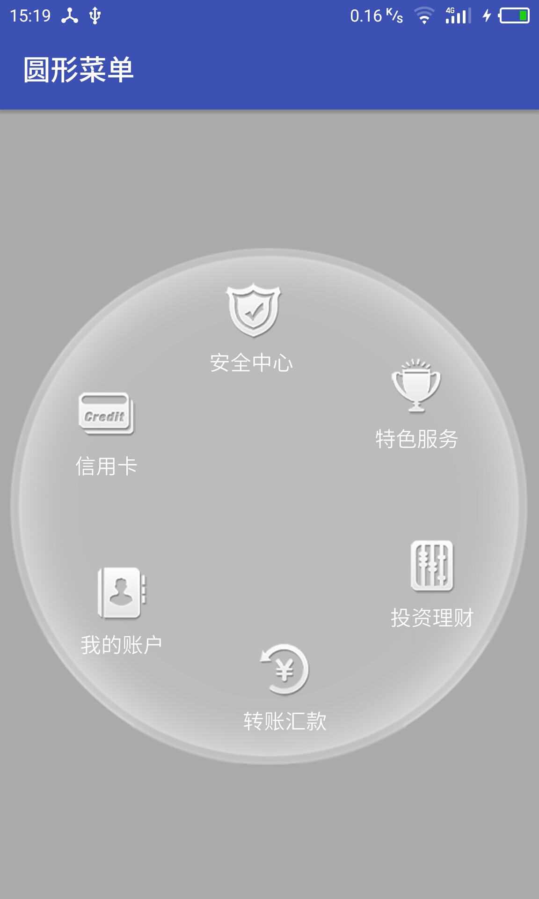
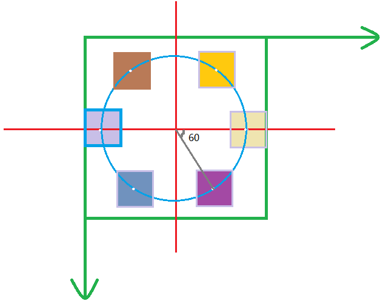
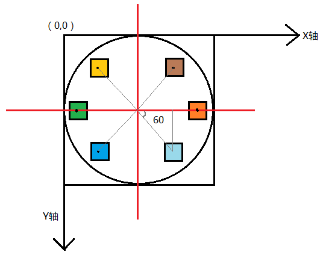
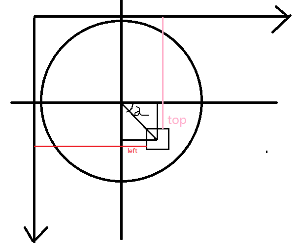
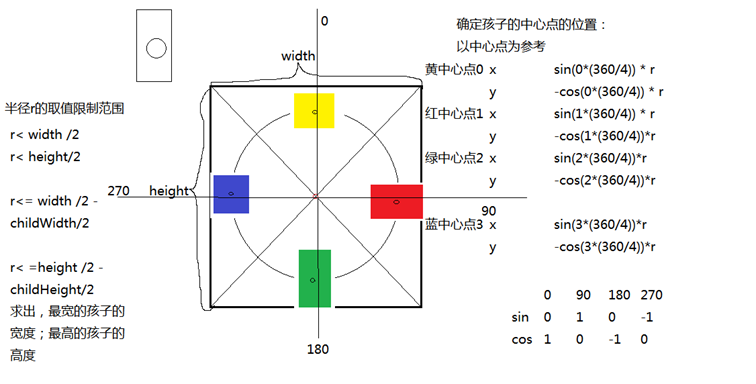

## 自定义控件之圆形菜单



## layout

如图所示，按钮之间的角度差等于360/按钮数，这里的角度差就是60度。根据几何知识可以算出每个按钮的左上右下坐标







```java
private int d;
private int startAngle;
@Override
protected void onLayout(boolean changed, int l, int t, int r, int b) {
	for (int i = 0; i < getChildCount(); i++) {
		View child = getChildAt(i);
		//获取孩子视图的测量宽度
		int childWidth = child.getMeasuredWidth();
		//temp:相当于自定义控件所在圆的圆心到子视图所在矩形的几何中心的距离
		float temp = d / 3.0f;
		int left = (int) (d / 2 + Math.round(temp * Math.cos(Math.toRadians(startAngle))) - childWidth / 2);
		int right = left + childWidth;
		int top = (int) (d / 2 + Math.round(temp * Math.sin(Math.toRadians(startAngle))) - childWidth / 2);
		int bottom = top + childWidth;
		child.layout(left, top, right, bottom);
		startAngle += 360 / getChildCount();
	}
}
```

## 让菜单动起来

先通过CircleUtil.getAngle()算出手指滑动的两个点之间的角度差angle，再重新计算出按钮的开始角度startAngle += angle;调用requestLayout()方法，让界面重新布局和绘制，就可以让菜单动起来

```java
private float lastX;
private float lastY;
@Override
public boolean onTouchEvent(MotionEvent event) {
	float x = event.getX();
	float y = event.getY();
	switch (event.getAction()) {
		case MotionEvent.ACTION_DOWN:
			lastX = x;
			lastY = y;
			break;
		case MotionEvent.ACTION_MOVE:
			float start = CircleUtil.getAngle(lastX, lastY, d);
			float end = CircleUtil.getAngle(x, y, d);
			float angle;
			//判断点击的点所处的象限,如果是1,4象限,角度值是正数,否则是负数
			if (CircleUtil.getQuadrant(x, y, d) == 1 || CircleUtil.getQuadrant(x, y, d) == 4) {
				angle = end - start;
			} else {
				angle = start - end;
			}
			startAngle += angle;
			//让界面重新布局和绘制
			requestLayout();
			lastX = x;
			lastY = y;
			break;
		case MotionEvent.ACTION_UP:
			break;
	}
	return true;
}
```
CircleUtil，计算触摸点的角度和象限的工具类
```java
public class CircleUtil {
  
	public static float getAngle(float xTouch, float yTouch,int d) {
		double x = xTouch - (d / 2f);
		double y = yTouch - (d / 2f);
		//hypot:通过两条直角边,求斜边
		return (float) (Math.asin(y / Math.hypot(x, y)) * 180 / Math.PI);
	}

	public static int getQuadrant(float x, float y,int d) {
		int tmpX = (int) (x - d / 2);
		int tmpY = (int) (y - d / 2);
		if (tmpX >= 0) {
			return tmpY >= 0 ? 4 : 1;
		} else {
			return tmpY >= 0 ? 3 : 2;
		}

	}
}
```

所需数据源

```java
private String[] mItemTexts = new String[] { "安全中心 ", "特色服务", "投资理财",
      "转账汇款", "我的账户", "信用卡" };
private int[] mItemImgs = new int[] { R.drawable.home_mbank_1_normal,
      R.drawable.home_mbank_2_normal, R.drawable.home_mbank_3_normal,
      R.drawable.home_mbank_4_normal, R.drawable.home_mbank_5_normal,
      R.drawable.home_mbank_6_normal };
```

准备条目布局

```xml
<?xml version="1.0" encoding="UTF-8"?>
<LinearLayout xmlns:android="http://schemas.android.com/apk/res/android"
              android:layout_width="180dp"
              android:layout_height="180dp"
              android:gravity="center"
              android:orientation="vertical">

    <ImageView
        android:id="@+id/id_circle_menu_item_image"
        android:layout_width="wrap_content"
        android:layout_height="wrap_content"
        />

    <TextView
        android:id="@+id/id_circle_menu_item_text"
        android:layout_width="wrap_content"
        android:layout_height="wrap_content"
        android:text="保险"
        android:textColor="@android:color/white"
        android:textSize="14.0dip"
        />

</LinearLayout>
```

在自定义ViewGroup中定义加入子条目信息的方法

```java
public void setMenuItemIconsAndTexts(int[] resIds, String[] texts) {
   //根据用户设置的参数，初始化view,并将View添加到当前ViewGroup中
   for (int i = 0; i < resIds.length; i++) {
      View view = LayoutInflater.from(getContext()).inflate(R.layout.circle_menu_item, this, false);
      ImageView iv = (ImageView) view.findViewById(R.id.id_circle_menu_item_image);
      TextView tv = (TextView) view.findViewById(R.id.id_circle_menu_item_text);

      iv.setImageResource(resIds[i]);
      tv.setText(texts[i]);

      // 添加view到容器中
      addView(view);
   }
}
```

设置数据到布局中

```java
public class MainActivity extends AppCompatActivity {
   private CircleMenuLayout mCircleMenuLayout;
   private String[] texts= new String[] { "安全中心 ", "特色服务", "投资理财",
         "转账汇款", "我的账户", "信用卡" };
   private int[] imgs= new int[] { R.drawable.home_mbank_1_normal,
         R.drawable.home_mbank_2_normal, R.drawable.home_mbank_3_normal,
         R.drawable.home_mbank_4_normal, R.drawable.home_mbank_5_normal,
         R.drawable.home_mbank_6_normal };

   @Override
   protected void onCreate(Bundle savedInstanceState)
   {
      super.onCreate(savedInstanceState);
      //自已切换布局文件看效果
      setContentView(R.layout.activity_main);
      mCircleMenuLayout = (CircleMenuLayout) findViewById(R.id.id_menulayout);
      //将准备的数据设置到自定义控件中,从而将数据设置到子视图中
      mCircleMenuLayout.setMenuItemIconsAndTexts(imgs, texts);
   }
}
```

处理测量操作

```java
//如果不做这个操作,当前控件的子控件将无法得到宽度和高度
@Override
protected void onMeasure(int widthMeasureSpec, int heightMeasureSpec) {
   super.onMeasure(widthMeasureSpec, heightMeasureSpec);
   //遍历当前控件,测量每个孩子视图
   for (int i = 0; i < getChildCount(); i++) {
      getChildAt(i).measure(widthMeasureSpec,heightMeasureSpec);
   }
}
```

布局条目的位置

```java
//定义控件所在的圆的直径
private int d = 480;
@Override
protected void onLayout(boolean changed, int l, int t, int r, int b) {
   float layoutRadius = d/2f;
   final int childCount = getChildCount();
   int left, top;
   // menu item 的尺寸
   int cWidth = getChildAt(0).getLayoutParams().width;
   // 根据单个条目占用的弧度
   float angleDelay = 360 / getChildCount();
   // 遍历去设置每个条目的位置
   for (int i = 0; i < childCount; i++) {
      final View child = getChildAt(i);
  //将角度和360取余数,使得角度只能在0-360度范围内
      mStartAngle %= 360;
      // 计算视图中心点到子条目中心点的距离
      float tmp = layoutRadius - cWidth / 2;
      //计算子条目的左边距
	  //Math.toRadians:将角度转化为弧度
	  //Math.round:四舍五入
	  //子条目的左边距=自定义控件的半径+(tmp的余弦值-子条目宽度的一半)
      left =(int) (layoutRadius
            +  Math.round(tmp
            * Math.cos(Math.toRadians(mStartAngle)) - 1 / 2f
            * cWidth));
      // 原理同left的计算方法
      top =(int)( layoutRadius
            +  Math.round(tmp
            * Math.sin(Math.toRadians(mStartAngle)) - 1 / 2f
            * cWidth));
	  //将子视图摆放到当前控件上
      child.layout(left, top, left + cWidth, top + cWidth);
      // 叠加尺寸
      mStartAngle += angleDelay;
   }
}
```

## 优化圆形菜单

- 当前圆形菜单的宽高设置对自定义控件效果的影响

  先获取MeasureSpec的size和mode，用户在布局文件中定义宽高的情况分为三种,但由于控件是圆的,我们要做如下处理

  - 当用户宽高均输入MATCH_PARENT

  mode为MeasureSpec.EXACTLY，此时若想要显示为圆形且不超过屏幕，需要取宽度和高度的较小值

  - 用户宽高均输入固定值

  mode为MeasureSpec.EXACTLY，想要显示为圆形可能超过屏幕,需要取宽度和高度的较小值

  - 用户宽高均输入wrap_content,由于无法确定控件宽高,则直接取屏幕宽度和高度的较小值

- 当圆形菜单的大小确定后,孩子视图的的大小就不能随意由用户设置了,应该和父布局匹配

  孩子视图的宽或高均为圆形菜单的宽高的1/4(仅仅是当前需求,实际开发中按开发需求设置)

```java
int childMeasureSpec = MeasureSpec.makeMeasureSpec((int) (mRadius / 4f), MeasureSpec.EXACTLY);
// 对孩子视图进行测量
for (int i = 0; i < getChildCount(); i++) {
getChildAt(i).measure(childMeasureSpec, childMeasureSpec);
}

//需求:不管用户传多大,都要完全显示当前自定义控件
int measureWidth;
int measureHeight;
//判断模式:
//判断模式主要处理两种:1,确切的 2,至多
int mode = MeasureSpec.getMode(widthMeasureSpec);
int size = MeasureSpec.getSize(widthMeasureSpec);
if (mode != MeasureSpec.EXACTLY) {
   //WRAP_CONTENT
   //未指定
   //指定包裹内容是包裹的背景?
   //原因:无法确定孩子视图的个数和大小,且为了能够让父布局完全显示子视图,则默认将WRAP_CONTENT设定为包裹背景,即:背景多大,控件就多大
   //背景有多大,控件就有多大
   //获取背景的宽度
   int suggestedMinimumWidth = getSuggestedMinimumWidth();
   //没有背景,判断将默认宽度作为控件宽度
   //如果suggestedMinimumWidth值为0,则无背景
   if (suggestedMinimumWidth == 0) {
      measureWidth = measureHeight = getDefaultWidth();
   } else {
      measureWidth = measureHeight = Math.min(suggestedMinimumWidth, getDefaultWidth());
   }

} else {
   //判断传入的宽度和屏幕宽度取较小值
   measureWidth = measureHeight = Math.min(size, getDefaultWidth());
}

d=measureWidth;

setMeasuredDimension(measureWidth, measureHeight);
for (int i = 0; i < getChildCount(); i++) {
   View child = getChildAt(i);
   //默认系统是可以通过onMeasure给予MeasureSpec参数的,而对于inflate进来的子视图是没有MeasureSpec参数的
   //故:需要我们自己设计MeasureSpec
   int makeMeasureSpec = MeasureSpec.makeMeasureSpec(d/3, MeasureSpec.EXACTLY);
   child.measure(makeMeasureSpec, makeMeasureSpec);
}
```

圆形菜单的手势旋转

```java
private float lastX;
private float lastY;

@Override
public boolean onTouchEvent(MotionEvent event) {
   float x = event.getX();
   float y = event.getY();
   switch (event.getAction()) {
      case MotionEvent.ACTION_DOWN:
         Log.i("test", "ACTION_DOWN");
         lastX = x;
         lastY = y;
         break;
      case MotionEvent.ACTION_MOVE:
         Log.i("test", "ACTION_MOVE");
     //获取触摸的点所在的角度
         float start = CircleUtil.getAngle(lastX, lastY, d);
         float end = CircleUtil.getAngle(x, y, d);
         float angle;
         //判断点击的点所处的象限,如果是1,4象限,角度值是正数,否则是负数
     //获取点所在的象限
         if (CircleUtil.getQuadrant(x, y, d) == 1 || CircleUtil.getQuadrant(x, y, d) == 4) {
            angle = end - start;
         } else {
            angle = start - end;
         }
     //将手指移动的角度叠加到绘制控件的起始角度上
         startAngle += angle;
         //让界面重新布局和绘制
         requestLayout();
         lastX = x;
         lastY = y;

         break;
      case MotionEvent.ACTION_UP:
         Log.i("test", "ACTION_UP");

         break;
   }
   //return true 表示当前控件想要处理事件,如果没有其他控件想要处理,则所有的MotionEvent事件都会交给自己处理
   return true;
}
```

## 摩天轮控件



```java
public class SkyWheel extends ViewGroup {
    
    PointF center; // 圆心
    float radius; // 半径
    double cellDegree; // 子控件间的夹角
    double diffDegree;
    private GestureDetector mDetector;
    private ValueAnimator mAnimator;

    public SkyWheel(Context context) {
        this(context,null);
    }

    public SkyWheel(Context context, AttributeSet attrs) {
        super(context, attrs);
        init();
    }

    private void init() {
        mDetector = new GestureDetector(getContext(),new GestureDetector
                .SimpleOnGestureListener(){

            @Override
            public boolean onDown(MotionEvent e) {
                if (mAnimator != null && mAnimator.isRunning()){
                    mAnimator.cancel();
                }
                return false;
            }

            /**
             * 手指点击一次的时候调用一次
             * @param e
             * @return
             */
            @Override
            public boolean onSingleTapUp(MotionEvent e) {
                // 点击时，判断当前点是否被某个子控件包含，如果包含直接调用子控件的点击事件即可
                int index = getClickPosition(e);
                if (index > -1){
                    getChildAt(index).performClick();// 强制让当前的控件的点击事件执行
                }
                return false;
            }

            /**
             * 
             * @param e1 按下事件 action—_down
             * @param e2 move事件，最近一次的action_move
             * @param distanceX = 上一次move事件的x值 - 当前move事件的x值
             * @param distanceY = 上一次move事件的y值 - 当前move事件的y值
             * @return
             */
            @Override
            public boolean onScroll(MotionEvent e1, MotionEvent e2, float distanceX, float distanceY) {
                // 计算出手指滑动过程中的角度变化夹角
                // 计算出起始点的角度
                double startDegree = getDegree(e2.getX()+distanceX, e2.getY()+distanceX);
                // 计算出结束点的角度
                double endDegree = getDegree(e2.getX(),e2.getY());
                // 计算出夹角
                double diff = endDegree - startDegree;
                setDegree(diffDegree + diff);
                
                return false;
            }

            /**
             * 
             * @param e1 手指按下的事件
             * @param e2 手指移动的事件
             * @param velocityX 手指离开屏幕时，在x轴的速率（像素/s）
             * @param velocityY 手指离开屏幕时，在y轴的速率（像素/s）
             * @return
             */
            @Override
            public boolean onFling(MotionEvent e1, MotionEvent e2, float velocityX, float velocityY) {
                // 计算当前点的角度
                double startDegree = getDegree(e2.getX(),e2.getY());
                // 计算1ms后的角度
                double endDegreeAfter1ms = getDegree(e2.getX() + velocityX/1000,e2.getY() + velocityY/1000);
                // 计算出1ms的角速度
                double velocityAfter1ms = endDegreeAfter1ms - startDegree;
                // 计算出1s的角速度
                double velocityAfter1s = velocityAfter1ms*1000;
                // 通过角速度设置，要移动到的角度
                startFlingAnimation(velocityAfter1s);
                return false;
            }
        });
    }

    private int getClickPosition(MotionEvent e) {
        // 遍历每个子控件是否包含当前点
        for (int i = 0; i < getChildCount(); i++) {
            View child = getChildAt(i);
            RectF rect = new RectF(child.getLeft(),child.getTop(),child.getRight(),child.getBottom());
            if (rect.contains(e.getX(),e.getY())){
                return i;
            }
        }
        return -1;
    }

    private void startFlingAnimation(double velocityAfter1s) {
        // 根据当前的角速度，计算出执行时间，与对应时间之后的角度变化
        int duration = (int) Math.abs(velocityAfter1s*1000);
        if (duration > 1000){
            duration = 1000;
        }
        // 计算出角度变化
        double diff = velocityAfter1s*duration/1000;
        // 设置角度变化
        mAnimator = ValueAnimator.ofFloat((float) diffDegree,(float) (diffDegree+diff));
        mAnimator.setDuration(1000);
        mAnimator.addUpdateListener(new ValueAnimator.AnimatorUpdateListener() {
            @Override
            public void onAnimationUpdate(ValueAnimator animation) {
                // 获取当前正在变化的角度，设置给转盘移动
                float animatedValue = (float) animation.getAnimatedValue();
                setDegree(animatedValue);
            }
        });
        // 设置先快后慢的插值器/估值器
        mAnimator.setInterpolator(new DecelerateInterpolator());
        mAnimator.start();
    }

    /**
     * 使用反正切函数计算出角度
     * @param x
     * @param y
     * @return
     */
    public double getDegree(float x, float y){
        return Math.atan2(y-center.y,x-center.x);
    }

    @Override
    protected void onLayout(boolean changed, int l, int t, int r, int b) {
        calculateValue();
        
        for (int i = 0; i < getChildCount(); i++) {
            View childView = getChildAt(i);
            // 根据三角函数的规律，排版每个子控件的位置
            childView.layout(
                    (int)(center.x + Math.sin(i*cellDegree + diffDegree)*radius - childView.getWidth()/2),
                    (int)(center.y - Math.cos(i*cellDegree + diffDegree)*radius - childView.getHeight()/2),
                    (int)(center.x + Math.sin(i*cellDegree + diffDegree)*radius + childView.getWidth()/2),
                    (int)(center.y - Math.cos(i*cellDegree + diffDegree)*radius + childView.getHeight()/2)
            );
        }
    }

    /**
     * 计算圆心、半径、夹角
     */
    public void calculateValue(){
        
        // 圆心
        center = new PointF();
        center.x = getWidth()/2;
        center.y = getHeight()/2;

        int maxwidth = 0;
        int maxheight = 0;

        for (int i=0; i<getChildCount();i++){
            maxwidth = Math.max(maxwidth,getChildAt(i).getWidth());
            maxheight = Math.max(maxheight,getChildAt(i).getHeight());
        }
        
        // 半径
        float r1 = center.x - maxwidth;
        float r2 = center.y - maxheight;
        radius = Math.min(r1,r2);
        
        // 夹角
        cellDegree = Math.PI*2/getChildCount();
    }

    /**
     * 动态切换控件的位置
     * @param degree
     */
    public void setDegree(double degree){
        diffDegree += degree;
        // 强制控件重新排版，onlayout()方法重新执行
        requestLayout();
    }

    @Override
    public boolean onTouchEvent(MotionEvent event) {
        mDetector.onTouchEvent(event);
        return true;
    }

    @Override
    public boolean onInterceptTouchEvent(MotionEvent ev) {
        return true;
    }
}
```